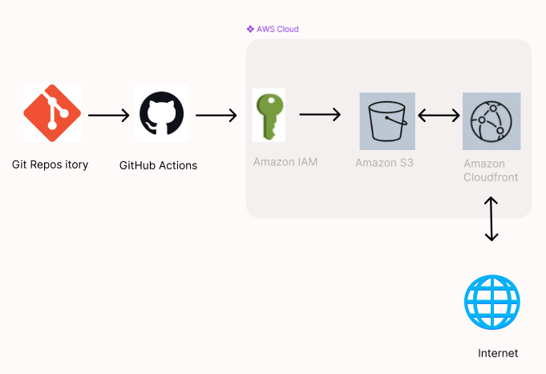
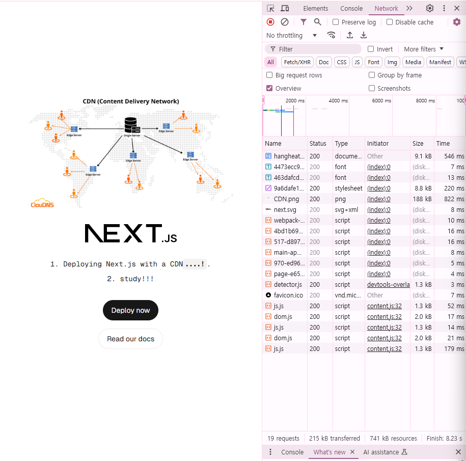
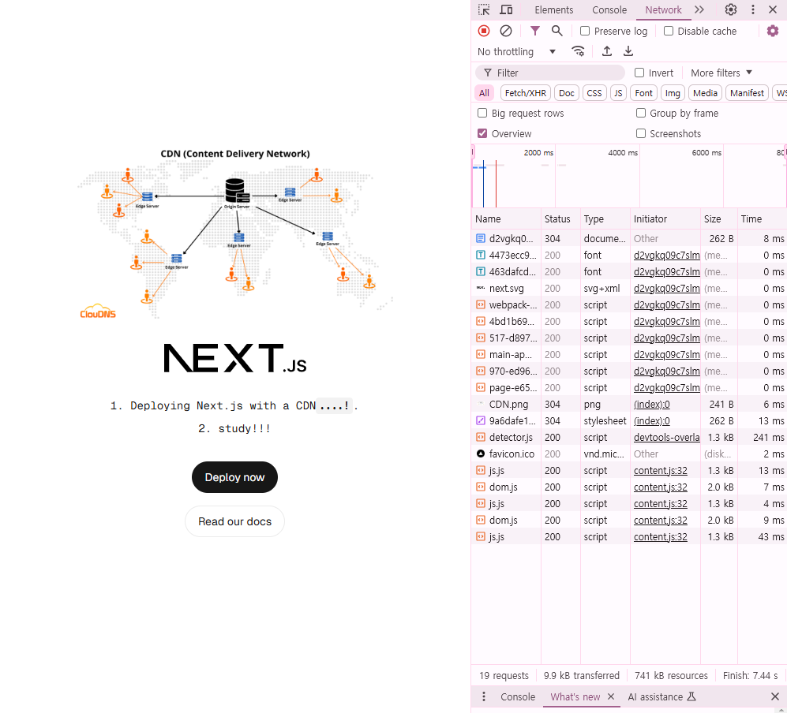

## 프론트엔드 배포 파이프라인

## 개요
GitHub Actions에 워크플로우를 작성해 다음과 같이 배포가 진행되도록 합니다.

1. 저장소를 체크아웃합니다.
2. Node.js 18.x 버전을 설정합니다.
3. 프로젝트 의존성을 설치합니다.
4. Next.js 프로젝트를 빌드합니다.
5. AWS 자격 증명을 구성합니다.
6. 빌드된 파일을 S3 버킷에 동기화합니다.
7. CloudFront 캐시를 무효화합니다.

## 주요 링크
- S3 버킷 웹사이트 엔드포인트: http://hangheatestbucket.s3-website-us-east-1.amazonaws.com
- CloudFrount 배포 도메인 이름: https://d2vgkq09c7slm2.cloudfront.net

## 주요 개념

- GitHub Actions과 CI/CD 도구: GitHub Actions는 코드 변경 시 자동으로 배포 및 테스트를 수행하는 CI/CD 도구로, 빌드, 테스트, 배포 과정을 자동화합니다.
- S3와 스토리지: Amazon S3는 클라우드 기반 객체 스토리지로, 정적 웹사이트 콘텐츠(HTML, CSS, JavaScript 등)를 저장하고 제공하는 데 사용됩니다.
- CloudFront와 CDN: Amazon CloudFront는 전 세계 엣지 로케이션을 통해 콘텐츠를 캐싱하여 사용자에게 빠르게 제공하는 CDN 서비스입니다.
- 캐시 무효화(Cache Invalidation): CloudFront의 캐시된 콘텐츠를 갱신하기 위해 기존 캐시를 삭제하는 작업으로, 콘텐츠 변경 후 최신 파일을 제공하는 데 사용됩니다.
- Repository secret과 환경변수: GitHub Secrets는 민감한 정보를 안전하게 저장하고 배포 스크립트에서 사용하는 환경 변수로, API 키, AWS 자격 증명 등을 관리합니다.

## CDN과 성능최적화

### **비교 데이터 표**

| 항목 | S3 단독 사용 | CDN 도입 | 개선 결과 |
| --- | --- | --- | --- |
| **총 요청 수** | 19개 | 19개 | **변화 없음** |
| **전송된 데이터량** | 215kB | 9.9kB | **205.1kB 감소 (95% 개선)** |
| **로드 완료 시간** | 8.23초 | 7.44초 | **0.79초 감소 (9.6% 개선)** |
| **DOMContentLoaded** | 546ms | 8ms | **538ms 감소 (98.5% 개선)** |
| **첫 번째 요청 시간** | 546ms | 8ms | **538ms 감소 (98.5% 개선)** |

분석 요약
1. **데이터 전송량 감소**:
    - CDN 도입으로 인해 전송 데이터량이 215kB에서 9.9kB로 크게 감소하여 네트워크 사용량이 최적화되었습니다.
2. **로드 완료 시간 단축**:
    - 전체 로드 시간이 8.23초에서 7.44초로 9.6% 개선되었습니다.
3. **DOMContentLoaded 이벤트 시간**:
    - DOMContentLoaded 이벤트가 546ms에서 8ms로 개선되며, 브라우저가 콘텐츠를 더 빠르게 렌더링할 수 있게 되었습니다.
4. **첫 번째 요청 시간**:
    - 첫 요청 시간이 546ms에서 8ms로 대폭 감소하여, 초기 페이지 로드가 훨씬 빨라졌습니다.